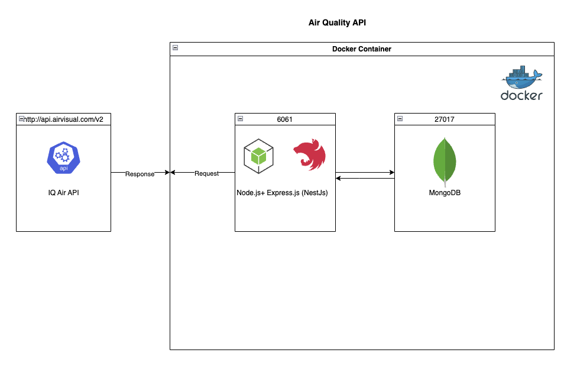

# Air Quality Project

---

## Responsibilities

The `air-quality-project` is a NestJS-based application designed to provide real-time air quality data. Running within a Docker container for seamless deployment, this service features a well-structured backend architecture comprising a Controller for handling HTTP requests, a Service layer encapsulating the business logic, and a comprehensive Validation Pipe ensuring the integrity of input data. It interacts seamlessly with the external [IQAIR](https://www.iqair.com/fr/commercial/air-quality-monitors/airvisual-platform/api) [API](https://api-docs.iqair.com/) to fetch the latest air quality metrics, and integrates with a database for persistent storage and retrieval of data. This project, ideal for both web and mobile applications, offers a programmatic interface for accessing up-to-date air quality information, making it an invaluable tool for environmental monitoring.


## Architecture




### API

- Express
- [NestJs](https://nestjs.com/)
- MongoDB/Mongoose

## Prerequisites
Clone the repository locally, create a new file named `.env` in the root of the project. Set an environment variable `IQAIR_API_KEY` to the value of your IQ Air Api Key. You can create a new API key on the official IQ Air [website](https://www.iqair.com/fr/commercial/air-quality-monitors/airvisual-platform/api).


## Setup (container)

This project is primarily packaged with docker and orchestrated via docker compose. You can install docker on the official [website](https://docs.docker.com/get-docker/).

Once you have installed docker and have it running locally, execute:

```bash
docker-compose up --build
```

 from the project root to start the local express and mongodb server. You will see a `Air quality application started on port 6061` once the application is started successfully and ready to receive requests

## Setup (Local Development - Skip if you already did container setup)

Alternatively, if you'll rather run the application locally/natively on your machine, install [nodejs](https://nodejs.org/en/download) and [mongodb](https://www.mongodb.com/docs/manual/installation/) via the official website. Start the mongodb service.

execute `npm install` from the project root to install packages. Once npm packages are installed, you can run the service locally via: 

```bash
`npm run start:dev`
```

---

The service should now be available via `http://localhost:6061/` and can be tested via the health-check endpoint at `http://localhost:6061/health`. Code is hot-reloaded, but may take a few seconds to correctly reload.
OpenAPI documentation is available via `http://localhost:6061/docs/`

### Versioning

 To ensure API versioning, all resource endpoints are mounted on /v1, therefore, to access the endpoints, append `/v1` to the host like so: `http://localhost:6061/v1`. For example, to get air quality for Paris, navigate to `http://localhost:6061/v1/air-quality?latitude=48.856613&longitude=2.352222`.

### Enpoints
- [GET] `http://localhost:6061/v1/air-quality` (Expected query params - `latitude:` number, `longitude`: number). Get air quality data. The air quality data persisted in the database is the US standard, i.e., aqius.
- [GET] `http://localhost:6061/v1/air-quality/datetime/most-polluted`. Get the most polluted time period in Paris

### Background Job
A cron job is scheduled to run every minute. This job primarily persists air quality data and timestamp which can in turn be queried at any future time.

### Tests
The api provisions automated tests to test the service, request client and anticipated edge cases. You can run all tests via:

```bash
npm test
```
Alternatively, you can run and watch all tests via:
```bash
npm run test:watch
```